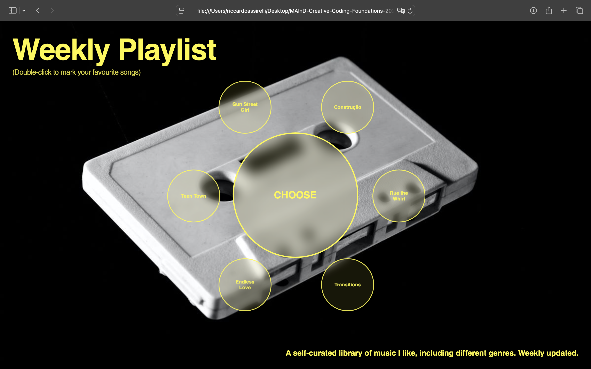

## Brief
Starting from the concept of a **pinboard**, implement a web page that:
- is responsive (proper layout for smartphone, tablet, and desktop)
- allows the user to add and remove elements
- allows the user to customize elements (e.g., colors, size)
- allows switching between at least two views

## Final Result
 

## Short Description
**Weekly Playlist** is a personal web playlist based on an interactive circular song selector. It allows users to explore, play, and highlight the music I share. Each track can be activated with a click or marked as a favorite with a double-click, creating a customizable and engaging music space.

## Functional Logic and Interaction
- **Expand/Collapse:** hovering the central circle adds/removes the `expanded` state, revealing or hiding the outer song nodes.  
- **Play:** click a song node to start its audio and set the page background to that song’s image.  
- **Stop:** click the central circle to stop playback and restore the initial background.  
- **Favorite:** double-click a song node to toggle “favorite”; favorite nodes stay visible even when the wrapper collapses.  
- **Responsiveness:** desktop default + a tablet/mobile breakpoint at `max-width: 1024px`.

## Functions & Events

| Name | Type | Arguments | What it does | Returns |
|---|---|---|---|---|
| `positionCircles()` | function | — | Computes polar coordinates and places each `.small-circle` along the ring inside `.wrapper`. | `void` |
| `updateFavoriteVisibility()` | function | — | Adds/removes `.favorite-visible` so favorite nodes remain shown even without hover. | `void` |
| `outer click` (with timer) | event handler | `MouseEvent` | Distinguishes **single click** (play track + bg change + “STOP”) vs **double click** (toggle favorite + persist visibility). | `void` |
| `center click` | event handler | `MouseEvent` | Stops current audio, resets background, sets label to “CHOOSE”. | `void` |
| `center mouseenter` | event handler | `MouseEvent` | Adds `.expanded` to `.wrapper` (shows nodes). | `void` |
| `wrapper mouseleave` | event handler | `MouseEvent` | Removes `.expanded` (hides nodes), favorites remain via `.favorite-visible`. | `void` |
| `window resize` | event handler | `UIEvent` | Recomputes positions to keep the ring layout stable. | `void` |
