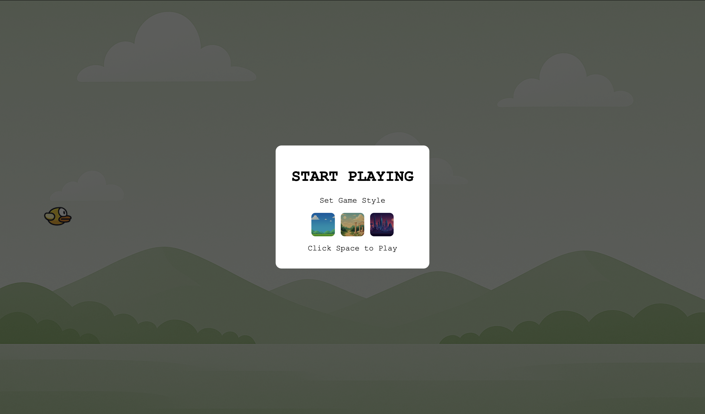
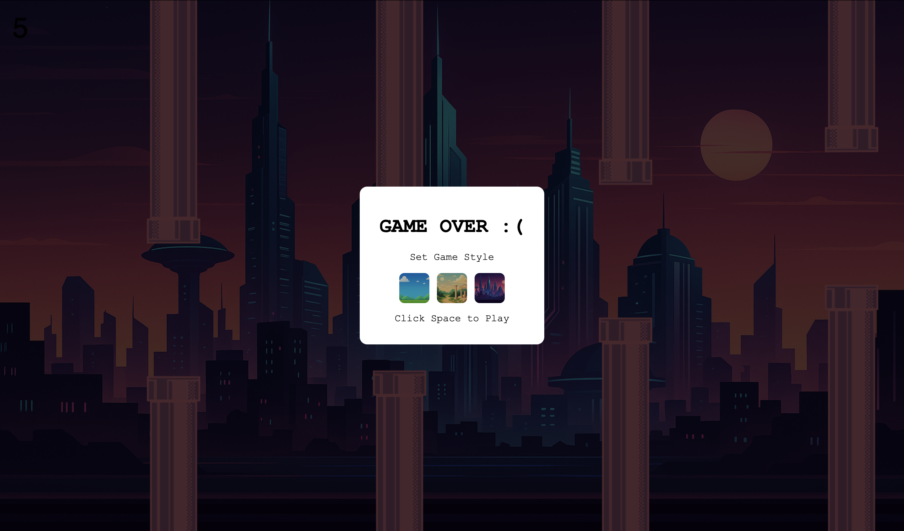

## Brief
Choose a **mini-game** to rebuild with HTML, CSS and JavaScript.  
The project must meet the following requirements:

- The webpage should be **responsive**
- The user must **choose an avatar** (or style) at the beginning
- The game must **keep track of the player's score**
- The player must use the **keyboard** to control the game (controls must be shown on the page); mouse can be used as optional input
- The game must include at least one **multimedia file** (images, audio, sprites…)
- The game must implement an **automatic restart** that does not refresh the page

## Final Result
    

## Short Description
**Flappy Bird – Custom Styles Mode** is a browser-based mini-game inspired by the original Flappy Bird.  
Before starting, the player selects a visual style through a simple popup interface. Each style changes the background and pipe graphics, creating a lightweight customization system. The player controls the bird using the keyboard to fly through randomly generated pipes and accumulate points by passing through them.

## Block Diagram
The diagram below shows the main logic of the game: including initialization, style selection, update loop, collision handling and restart.

  

## Game Interactions
- **Start / Restart:** the game begins when the player presses **Space**; after a game over, the same key restarts the run inside the popup.
- **Style Selection:** clicking one of the thumbnails in the popup sets the visual theme (background and pipes) for the next game session.
- **Jump / Fly:** pressing **Space** during gameplay makes the bird jump upward while gravity continuously pulls it down.
- **Scoring:** each time the bird successfully passes a pair of pipes, the score increases.
- **Collision:** touching the ground or hitting any pipe triggers the game-over popup.
- **Responsiveness:** the canvas covers the entire viewport and remains playable across different screen sizes, keeping the bird anchored on the left side.

## List of Functions
### 1. Task-Specific Functions
| Name | Parameters | What it does | Returns |
|------|------------|--------------|---------|
| `detectCollision(a, b)` | `a`: bird object `b`: pipe object | Checks if the bounding boxes of the bird and a pipe overlap to detect a collision. | `boolean` |
| `resetGameState()` | — | Resets bird position, vertical speed, score, pipe array, and game-over state to prepare for a new run. | `void` |
| `placePipes()` | — | Creates a new pair of pipes with randomized vertical position and adds them to the pipe list. | `void` |
| `endGame()` | — | Activates the game-over state, stops gameplay, and displays the restart popup. | `void` |

### 2. UI & Graphics
| Name | Parameters | What it does | Returns |
|------|------------|--------------|---------|
| `applyStyle(styleId)` | `styleId`: string | Updates background image, pipe sprites and bird sprite based on the selected game style. | `void` |
| `showPopup(mode)` | `mode`: `"start"` or `"gameOver"` | Shows the popup interface used for both game start and restart. | `void` |
| `hidePopup()` | — | Hides the popup and enables the game to begin. | `void` |

### 3. Game Loop
| Name | Parameters | What it does | Returns |
|------|------------|--------------|---------|
| `update()` | — | Main animation loop: applies gravity, moves the bird, scrolls pipes, checks collisions, updates the score, and redraws the entire game scene each frame. | `void` |

