## Brief
Upgrade the Assignment 02 by adding the use of data coming from an external web API. For example, fetch contents (audio, images, video, text, metadata) from online archives, AI generated contents (chatGPT API), data (weather, realtime traffic data, environmental data). The application **must** have those requirements:

- The webpage is responsive
- Use a web API (you choose which one best fists for your project) to load the data and display them in the webpage
- At least one multimedia file (for user feedback interactions, or content itself)
- Develop a navigation system that allows the user to navigate different sections with related content and functionalities

## Final Result
   

## Short Description
**Flappy Bird – World Clock Variant** is a browser-based mini-game inspired by the original Flappy Bird.  
Before starting, the player selects a world place to ply in through a simple popup interface. Each area changes the background and pipe graphics. Also, according to the current time in this place, the style can change between morning, night and sunset/sunrise. The player controls the bird using the keyboard to fly through randomly generated pipes and accumulate points by passing through them.

## Block Diagram
The diagram below shows the main logic of the game: including initialization, style selection, update loop, collision handling and restart.

  

## Game Interactions
- **Start / Restart:** the game begins when the player presses **Space**; after a game over, the same key restarts the run inside the popup.
- **Style Selection:** clicking one of the thumbnails in the popup sets the visual theme (background and pipes) for the next game session.
- **Jump / Fly:** pressing **Space** during gameplay makes the bird jump upward while gravity continuously pulls it down.
- **Scoring:** each time the bird successfully passes a pair of pipes, the score increases.
- **Collision:** touching the ground or hitting any pipe triggers the game-over popup.
- **Responsiveness:** the canvas covers the entire viewport and remains playable across different screen horizzontally re-sized, keeping the bird anchored on the left side.

## List of Functions
### 1. Task-Specific Functions
| Name | Parameters | What it does | Returns |
|------|------------|--------------|---------|
| `detectCollision(a, b)` | `a`: bird object `b`: pipe object | Checks if the bounding boxes of the bird and a pipe overlap to detect a collision. | `boolean` |
| `resetGameState()` | — | Resets bird position, vertical speed, score, pipe array, and game-over state to prepare for a new run. | `void` |
| `placePipes()` | — | Creates a new pair of pipes with randomized vertical position and adds them to the pipe list. | `void` |
| `endGame()` | — | Activates the game-over state, stops gameplay, and displays the restart popup. | `void` |

### 2. UI & Graphics
| Name | Parameters | What it does | Returns |
|------|------------|--------------|---------|
| `applyStyle(styleId)` | `styleId`: string | Updates background image, pipe sprites and bird sprite based on the selected game style. | `void` |
| `showPopup(mode)` | `mode`: `"start"` or `"gameOver"` | Shows the popup interface used for both game start and restart. | `void` |
| `hidePopup()` | — | Hides the popup and enables the game to begin. | `void` |

### 3. Game Loop
| Name | Parameters | What it does | Returns |
|------|------------|--------------|---------|
| `update()` | — | Main animation loop: applies gravity, moves the bird, scrolls pipes, checks collisions, updates the score, and redraws the entire game scene each frame. | `void` |

## API documentation
https://timezonedb.com/references/get-time-zone

